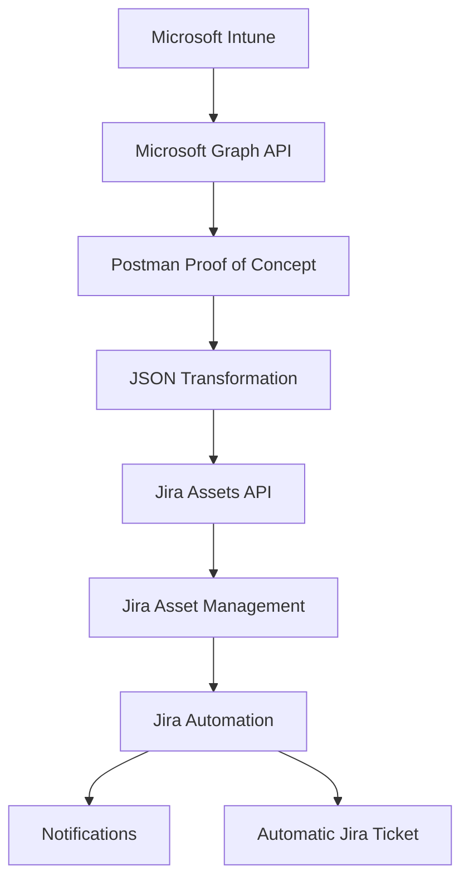

# Jira Asset Management + Microsoft Intune Integration

## Project Summary

**Status:** Proof of Concept (Successfully Validated)

### Overview

While working in an enterprise environment, I identified a manual asset management process that was consuming time and frequently resulted in inaccurate inventory records.

I proposed building an automated integration between Microsoft Intune and Jira Asset Management to synchronize endpoint information automatically.

The proof of concept successfully demonstrated that Microsoft Intune devices could automatically update Jira Assets using Microsoft Graph API, REST APIs, and Jira Automation.

Although the solution was technically validated and demonstrated to management, the initiative was not moved into production following an organizational restructuring that shifted project priorities.

## Business Problem

The IT department maintained hardware assets manually inside Jira Asset Management.

Whenever a device changed ownership, was re-enrolled, or received updates, IT staff had to manually update:

- Assigned User
- Computer Name
- Asset Tag
- Operating System
- Compliance Status

This process was repetitive, time-consuming, and susceptible to human error, resulting in outdated asset information.

## Proposed Solution

I proposed developing an automated integration between Microsoft Intune and Jira Asset Management.

The solution would:

- Retrieve managed device information from Microsoft Intune using Microsoft Graph API.
- Match existing Jira Assets using the device Serial Number as the primary identifier.
- Automatically synchronize endpoint information whenever changes occurred.

The synchronized information included:

- Primary User
- Device Name
- Asset Tag
- Operating System
- Compliance Status

## Architecture


```
